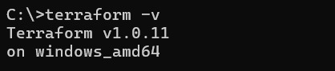
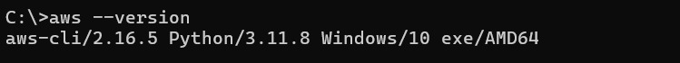
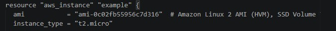
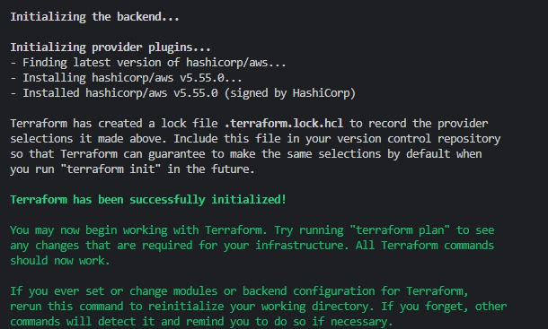
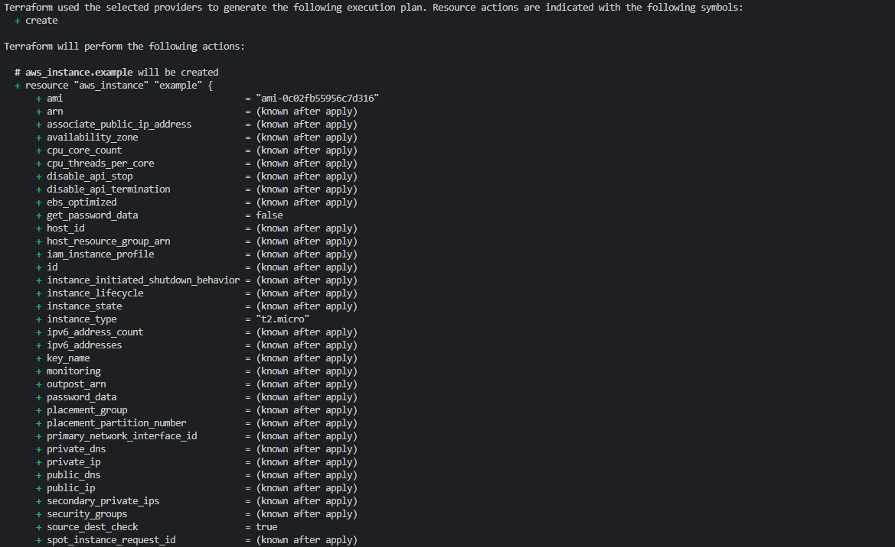
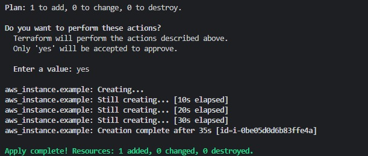

## Tutorial: Como dialogar com ambiente Cloud utilizando Terraform

# Passo 1 - Instalando Terraform: 
1. Para instalação de Terraform, o primeiro passo é acessar a <b>PowerShell do Windows, executando-a como administrador</b>, mas <b>IMPORTANTE</b>: 

  -  Ao executar a PowerShell, o diretório estará na pasta Systema32, é crucial que faça a instalação na raiz do disco.

 

2. No PowerShell do Windos, execute o comando abaixo até chegar na raiz do seu armazenamento:

~~~
cd ..
~~~

 

3. Agora, na raiz do seu projeto, para instalar o Terraform, execute essa série de comandos na PowerShell:

~~~
Invoke-WebRequest -Uri https://releases.hashicorp.com/terraform/1.0.11/terraform_1.0.11_windows_amd64.zip -OutFile terraform.zip
~~~

~~~
Expand-Archive -Path terraform.zip -DestinationPath C:\terraform
~~~

~~~
[System.Environment]::SetEnvironmentVariable('PATH', $env:PATH + ';C:\terraform', [System.EnvironmentVariableTarget]::Machine)
~~~

 

4. Cheque se o Terraform foi instalado, use o comando no Terminal

~~~
Terraform -v 
~~~

- É esperado que retorne a versão do terraform no seu termina:

# Passo 2 - Instalando AWS CLI

1. Novamente, para realizar a instalação, o primeiro passo é executar o Windows PowerShell como administrador, e seguir os mesmos passos citados anteriormente para chegar a raiz do seu armazenamento, a seguir, execute os comandos no seu terminal:

~~~
Invoke-WebRequest -Uri https://awscli.amazonaws.com/AWSCLIV2.msi -OutFile AWSCLIV2.msi
~~~

~~~
Start-Process msiexec.exe -Wait -ArgumentList '/I AWSCLIV2.msi /quiet'
~~~

 

2. Por fim, execute o comando para verficar a instalação 

~~~
aws --version
~~~

É esperado que o terminal exiba a versão do aws CLI instalada: 

# Passo 3 - Configurando AWS 

1. Vamos la! Com seu ambiente AWS, ou no caso do tutorial, o <a href="https://awsacademy.instructure.com/">ambiente AWS Academy</a> devidamente iniciado, abra o terminal na raiz do seu Armazenamento, execute o comando:

~~~
aws configure
~~~

 

2. Dentro do seu ambiente AWS Academy, acesse a aba AWS Details, e entre em AWS CLI, insira suas informações correspondete ao que o Terminal requisitar, no caso, <b>aws_access_key_id</b>, <b>aws_secret_access_key</b> e <b>Region</b>.

- IMPORTANTE: Consulte a região a qual sua maquna virtual está alocada.

 

3. Seguindo, acesse sua pasta Users, posteriormente a pasta correspondete a seu usuário, e entre na pasta .aws, execute terminal nesse diretório, e cole o comando abaixo:

~~~
notepad credentials
~~~

4. Dentro do notepad, altere o <b>aws_session_token </b>, copiando aquele presente dentro dos details do AWS Academy.

# Passo 4 - Criando uma Instância EC2 com Terraform

1. O primeiro passo dessa etapa é adicionar, dentro de uma pasta de sua escolha, um arquivo

~~~
main.tf
~~~

 

2. Dentro desse arquivo, adicione o seguinte código:

~~~
provider "aws" {
  region = "us-east-1"
}

resource "aws_instance" "example" {
  ami           = "ami-0c02fb55956c7d316"  # Amazon Linux 2 AMI (HVM), SSD Volume Type
  instance_type = "t2.micro"

  tags = {
    Name = "TerraformExample"
  }
}
~~~

 

- ATENTE-SE: Configure a variavel "region", de acordo com a região que sua maquina virtual está alocada, no caso, a mesma a qual você inseriu na configuração do aws na etapa passada.

3. Configure a variavel "instance_type", para o tipo de maquina virtual que for mais adequada para seu projeto, e para sua estimativa financeira, para fins de recomendação, use a <b>t2.micro</b>. 

# Passo 5 - Inicializando e Configurando o Terraform

1. No terminal, no diretório onde foi criado o arquivo main.tf, execute o comando: 

~~~
terraform init
~~~

- Se tudo ocorrer bem, você receberá essa resposta do terminal:

 
 
 

2. A partir disso a configuração ja estará pronta, mas é sempre bom para visualizar aquilo que será criado, execute o comando: 

~~~
terraform plan
~~~

- É de se esperar essa resposta no terminal (nota-se que há muito mais adições do que as que estão presentes na imagem abaixo):

 
 
 

3. E por fim, execute o comando: 

~~~
terraform apply
~~~

- Digite <i>"yes"</i> quando for requisitado no terminal. Após essa confirmação, é esperado essa resposta:

# Adicional -  Finalizando o Terraform

Para finalizar o Terraform, basta executar no terminal, dentro do diretório onde se encontra o arquivo main.tf

~~~
terraform destroy
~~~

